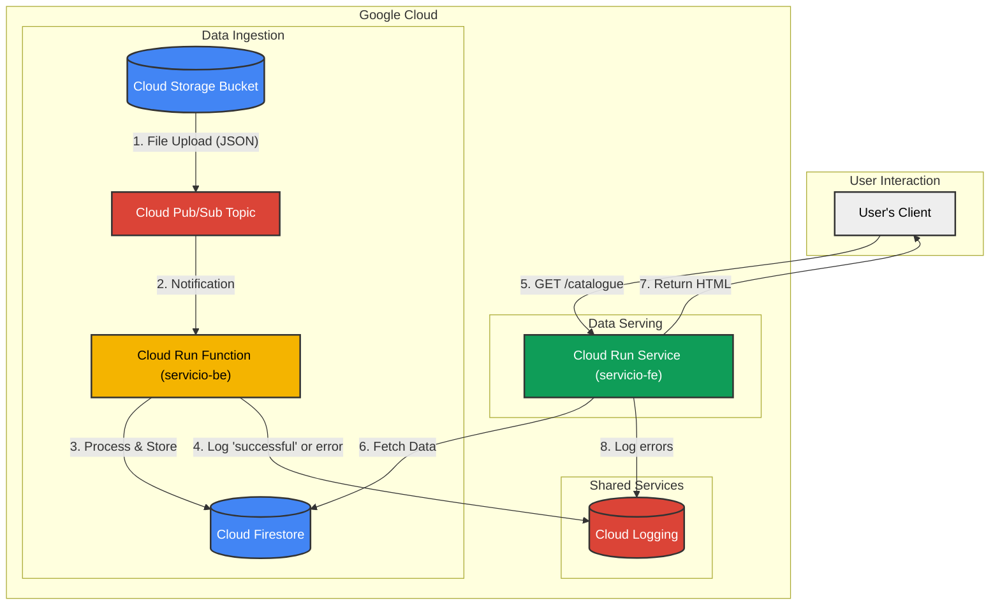

# README

Prueba track ingeniero de backend

## Descripción de la prueba

Instrucciones generales:

- Lee con detenimiento las instrucciones.
- Intenta verbalizar tus pasos, para saber qué tienes en mente y qué quieres hacer.
- El ejercicio está pensado para seguir una progresión general, intenta completar todos los pasos que puedas en el tiempo disponible.
- Si no eres capaz de completar del todo un apartado, intenta continuar con los siguientes pasos.
- Utiliza tu cuenta de usuario de Google corporativa y el proyecto de Google Cloud asignado.
- Utiliza Java como lenguaje, y tu IDE y herramientas de desarrollo local, o Cloud Shell Editor en la Google Cloud Console con su entorno preparado.

## Tareas a realizar

1. Prepara tu entorno de trabajo:
   1. Clona este repositorio en local: `git clone https://github.com/Indavelopers/prueba-track-backend.git`
   2. Comprueba que Cloud SDK está instalado y disponible, e inicia sesión con tu cuenta de usuario de Google si es necesario.
   3. Instala las librerías de cliente necesarias para utilizar Cloud Storage y Cloud Firestore.
2. Durante el desarrollo local, testea cada microservicio, y tras su despliegue, comprueba sus logs en Cloud Logging.
3. Microservicios:
   1. **servicio-be**: Función basada en eventos que es invocada con cada nuevo objeto JSON subido al bucket de Cloud Storage, a través del tema de Cloud Pub/Sub. Esta función extrae datos del archivo JSON, los valida y los carga en Cloud Firestore, según el esquema indicado, loguea `successful` o eleva una excepción si ha habido algún error.
   2. **servicio-fe**: API restful HTTP desarrollada en Java con Vert.x, en `GET /catalogue` devuelve un listado de productos recogido de Cloud Firestore en HTML, o eleva una excepción si ha habido algún error.
4. Configura la arquitectura:
   1. Usa el bucket de Cloud Storage proporcionado para subir archivos JSON como el ejemplo `productos-ejemplo.json`.
   2. Edita el tema de Cloud Pub/Sub proporcionado para recibir las notificaciones de nuevo objeto en dicho bucket:
      1. Configúralo como un tema de importación de Cloud Storage, habilitando la transferencia desde Cloud Storage a Cloud Pub/Sub, y asignando los permisos necesarios ([docs](https://docs.cloud.google.com/pubsub/docs/create-cloud-storage-import-topic)).
      2. Teniendo en cuenta el esquema indicado en `productos-ejemplo.json`, el microservicio `servicio-be` recibe múltiples productos a almacenar en un único archivo, por lo que no debemos dividir el objeto en diferentes mensajes de notificación. Por tanto, como carácter delimitador para dividir el objeto en varios mensajes, utiliza un carácter no incluido en el archivo como `|`.
   3. Crea un trigger de Cloud Run Functions para invocar el microservicio **servicio-be** suscrito a dicho tema de Cloud Pub/Sub:
      1. Usa la cuenta de servicio por defecto de Compute Engine para el trigger de EventArc.
      2. El mensaje de Cloud Pub/Sub contendrá simplemente el contenido del objeto JSON subido al bucket de Cloud Storage, en un mensaje en formato _Cloud Events_, disponible en _message.data_, codificado en base64.
   4. Usa la base de datos de Cloud Firestore proporcionada para almacenar y consultar los datos del objeto JSON.
5. Despliegua los servicios:
   1. **servicio-be** como una función de Java de Cloud Run Functions.
   2. **servicio-fe** como un servicio de Cloud Run.
   3. Usa las cuentas de servicio proporcionadas para cada microservicio.
6. Finalmente, testea los microservicios en un end-to-end y comprueba sus logs en Cloud Logging.

## Dispones de

- Tienes acceso libre a toda la documentación, tutoriales, quickstarts, etc., cualquier recurso público disponible. ¡Haz uso de ellos!
  - En la documentación de Google Cloud puedes encontrar instrucciones para cualquier configuración necesaria.
- Si tienes algún asistente de IA disponible (Gemini, Gemini Code Assist, Gemini Cloud Code, etc.), también puedes utilizarlo.
  - Recuerda que los asistentes de IA pueden no ser precisos al 100%, o no entenderte, o retrasarte por su latencia.
- IDE con Java y herramientas de trabajo local, o Cloud Shell.

Recursos:

- Archivo JSON con datos de ejemplo a cargar en la aplicación, e instrucciones para validar sus datos.
- Cuentas de servicio con roles pre-asignados para cada microservicio:
  - servicio-be: `roles/datastore.user`, `roles/logging.logWriter`
  - servicio-fe: `roles/datastore.viewer`, `roles/logging.logWriter`
- Bucket de Cloud Storage para recibir dichos archivos JSON.
- Tema de Cloud Pub/Sub para recibir notificaciones de nuevos objetos en el bucket de Cloud Storage.
- Base de datos `(default)` de Cloud Firestore donde almacenar y consultar los datos del objeto JSON.
- Repositorio de contenedores formato Docker en Artifact Registry `servicio-fe` en `europe-southwest1`.

## Evaluación

- Gestión de entornos de trabajo.
- Uso de documentación y recursos.
- Diseño y desarrollo de microservicios.
- Testeo y correcta ejecución de los microservicios.
- Capacidad de resolución de problemas técnicos.
- Seguimiento de buenas prácticas.
- Innovación y excelencia.

## APIs utilizadas

- run.googleapis.com
- cloudbuild.googleapis.com
- artifactregistry.googleapis.com
- eventarc.googleapis.com
- storage.googleapis.com
- firestore.googleapis.com
- pubsub.googleapis.com
- logging.googleapis.com

## Esquema Mermaid

